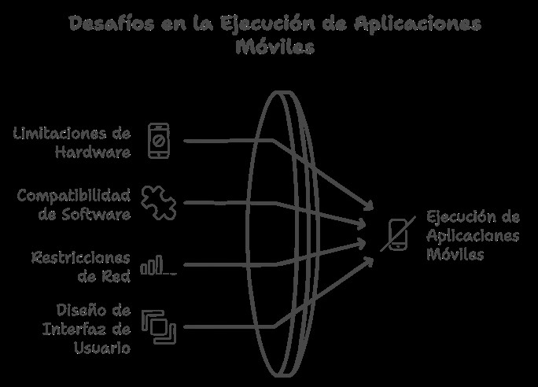
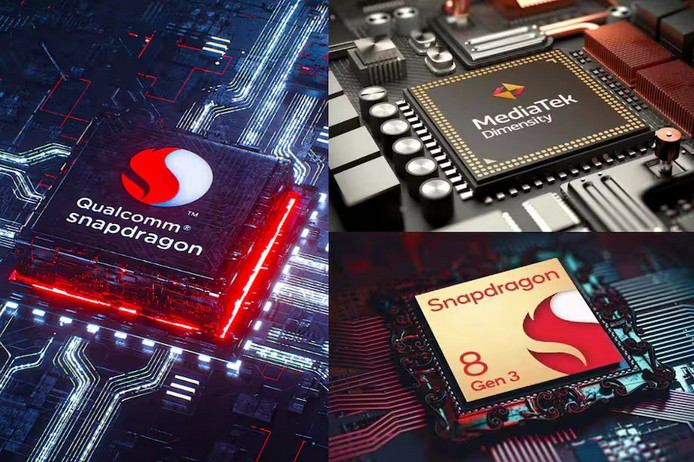
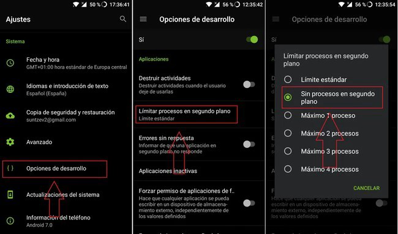
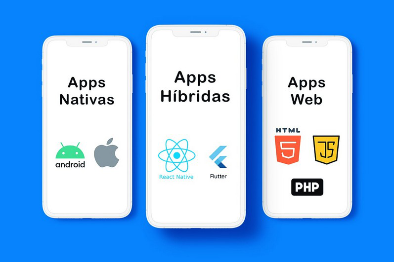

# Unidad 1. Análisis de tecnologías para aplicaciones en dispositivos móviles

**Módulo:** Programación Multimedia y Dispositivos Móviles  
**Ciclo:** 2.º DAM  
**Revisión y actualización:** septiembre de 2026

> Esta unidad presenta las restricciones de los dispositivos móviles, los principales enfoques de desarrollo y las arquitecturas habituales. La revisión actualiza el contenido hacia Kotlin, Jetpack Compose, SwiftUI, Kotlin Multiplatform, .NET MAUI, la arquitectura moderna de React Native e Ionic con Capacitor.

## Sumario

1. [Limitaciones en la ejecución de aplicaciones móviles](#1-limitaciones-en-la-ejecución-de-aplicaciones-móviles)
2. [Tecnologías de desarrollo](#2-tecnologías-de-desarrollo)
3. [Clasificación y características de los dispositivos móviles](#3-clasificación-y-características-de-los-dispositivos-móviles)
4. [Perfiles dispositivo-aplicación](#4-perfiles-dispositivo-aplicación)
5. [Estructura y arquitectura de aplicaciones móviles](#5-estructura-y-arquitectura-de-aplicaciones-móviles)
6. [Android Studio: instalación y configuración](#6-android-studio-instalación-y-configuración)
7. [Criterios para elegir tecnología](#7-criterios-para-elegir-tecnología)
8. [Referencias para ampliar](#8-referencias-para-ampliar)

---

## 1. Limitaciones en la ejecución de aplicaciones móviles

Los dispositivos móviles actuales ofrecen una gran capacidad de proceso, pero trabajan bajo restricciones distintas de las de un equipo de escritorio. Las limitaciones más relevantes no deben entenderse solo como falta de potencia, sino como un equilibrio entre **rendimiento, memoria, temperatura, autonomía, conectividad y ciclo de vida de la aplicación**.



*Figura 1. Ilustración del documento original sobre las restricciones de hardware.*

### 1.1. Hardware

- **CPU, GPU y aceleradores especializados.** El rendimiento disponible depende del SoC y de la carga de trabajo. En móvil son especialmente importantes el consumo energético y la disipación térmica. Un proceso intenso y sostenido puede provocar *thermal throttling*.
- **Memoria RAM.** Android e iOS pueden finalizar procesos que permanecen en segundo plano cuando necesitan recuperar memoria. La aplicación debe poder reconstruir su estado.
- **Almacenamiento.** Conviene limitar datos temporales, controlar cachés y evitar descargar o conservar información que no sea necesaria.
- **Batería.** GPS, cámara, pantalla, red móvil, procesamiento continuo y tareas en segundo plano pueden tener un coste energético elevado.
- **Pantalla y factor de forma.** Una interfaz moderna debe adaptarse a distintos tamaños, orientaciones, densidades, tablets y dispositivos plegables.

### 1.2. Software y ciclo de vida

Android e iOS aíslan las aplicaciones mediante mecanismos de seguridad y restringen el acceso al hardware y a los datos personales. El sistema operativo controla además cuándo una aplicación puede continuar ejecutándose en segundo plano.

Aspectos fundamentales:

- solicitar solo los **permisos mínimos necesarios**;
- asumir que el proceso puede detenerse y posteriormente recrearse;
- utilizar las APIs recomendadas para trabajo diferido y segundo plano;
- comprobar la compatibilidad con diferentes versiones del sistema operativo;
- diseñar teniendo en cuenta cambios de configuración y recuperación de estado.

### 1.3. Conectividad

Una aplicación móvil no debe asumir una conexión permanente, rápida ni estable.

- La cobertura puede cambiar entre Wi-Fi y redes celulares.
- La latencia y el ancho de banda son variables.
- El usuario puede perder temporalmente la conexión.
- El tráfico tiene coste energético y, en algunos contratos, económico.

Por tanto, resulta conveniente aplicar estrategias **offline-first** cuando el caso de uso lo permita: caché local, sincronización posterior, reintentos controlados e interfaces que comuniquen correctamente el estado de la conexión.

### 1.4. Fragmentación y diversidad

La fragmentación no se limita a la versión de Android. También intervienen tamaño y densidad de pantalla, arquitectura del procesador, sensores disponibles, personalizaciones del fabricante y factores de forma.

En lugar de diseñar para un modelo concreto, es preferible trabajar con **capacidades**, layouts adaptativos y pruebas en una matriz representativa de dispositivos.

### 1.5. Seguridad y privacidad



*Figura 2. Ilustración del documento original sobre seguridad y privacidad.*

Una aplicación móvil segura debe aplicar, entre otras, estas prácticas:

- principio de mínimo privilegio en permisos;
- cifrado de las comunicaciones mediante HTTPS/TLS;
- almacenamiento seguro de secretos y credenciales;
- autenticación y gestión de sesión correctas;
- actualización de dependencias;
- validación de entradas y tratamiento seguro de datos externos;
- recopilación únicamente de los datos personales necesarios.

Como referencia de buenas prácticas de seguridad móvil resulta útil **OWASP MASVS**.

### 1.6. UX, accesibilidad y diseño adaptativo

La interfaz debe ser táctil, legible y accesible. Es importante contemplar contraste, tamaño de los objetivos táctiles, lectores de pantalla, escalado del texto y navegación coherente.

El diseño adaptativo permite que una aplicación aproveche teléfonos, tablets y plegables sin limitarse a "estirar" una única pantalla.

### 1.7. Rendimiento gráfico

Juegos, realidad aumentada, vídeo y animaciones requieren controlar el trabajo de CPU/GPU, la memoria gráfica y la temperatura. Debe medirse el rendimiento en dispositivos reales y evitar trabajo innecesario en cada frame.

### Conclusión

Optimizar una aplicación móvil no significa únicamente hacerla rápida. Significa utilizar responsablemente CPU, memoria, almacenamiento, red y batería, respetar el ciclo de vida del sistema y ofrecer una experiencia adaptable, accesible y segura.

---

## 2. Tecnologías de desarrollo

Podemos distinguir tres grandes enfoques: **nativo**, **multiplataforma** e **híbrido basado en tecnologías web**. Ninguno es universalmente mejor; la elección depende del equipo, el producto y las plataformas objetivo.

### 2.1. Desarrollo nativo



*Figura 3. Ilustración del documento original asociada al desarrollo nativo.*

#### Android

- **Lenguaje principal:** Kotlin. Java continúa siendo compatible y es relevante para mantener proyectos existentes.
- **IDE oficial:** Android Studio.
- **UI moderna recomendada:** **Jetpack Compose**, toolkit declarativo de Android.
- **Diseño:** Material 3 y layouts adaptativos.
- **Arquitectura habitual:** UI + `ViewModel` + flujo unidireccional de datos + capa de datos/repositorios.
- **Concurrencia y datos reactivos:** coroutines, `Flow` y `StateFlow`.

El sistema clásico basado en XML, `Activity`, `Fragment`, `View` y `RecyclerView` sigue siendo importante para comprender y mantener aplicaciones existentes. Sin embargo, para proyectos nuevos la enseñanza debe dar protagonismo a Compose.

Ejemplo mínimo:

```kotlin
@Composable
fun Greeting(name: String) {
    Text(text = "Hola, $name")
}
```

#### iOS

- **Lenguaje principal:** Swift. Objective-C permanece principalmente en proyectos heredados.
- **IDE:** Xcode.
- **UI:** **SwiftUI** como enfoque declarativo moderno y UIKit como framework fundamental del ecosistema y del código existente.

### 2.2. Desarrollo híbrido web: Ionic + Capacitor

Las aplicaciones híbridas permiten reutilizar HTML, CSS y JavaScript/TypeScript dentro de una aplicación que puede acceder a capacidades nativas.

**Ionic** proporciona componentes y herramientas de interfaz, mientras que **Capacitor** actúa como runtime moderno para integrar la aplicación web con Android, iOS y APIs nativas.

**Apache Cordova** fue una tecnología pionera y sigue apareciendo en proyectos heredados y plugins, pero ya no debería presentarse como la opción central de un proyecto Ionic nuevo.

Ventajas:

- reaprovechamiento de conocimientos web;
- gran porcentaje de código compartido;
- acceso a capacidades nativas mediante plugins.

Consideraciones:

- la UI se ejecuta principalmente en una WebView;
- ciertas necesidades avanzadas pueden requerir código o plugins nativos;
- hay que evaluar rendimiento y experiencia de usuario según el producto.

### 2.3. Desarrollo multiplataforma

#### React Native

React Native utiliza React y JavaScript/TypeScript para crear aplicaciones con integración nativa.

La explicación histórica basada en un **bridge asíncrono** ya no representa la arquitectura actual. Desde React Native 0.82 la **New Architecture** es la arquitectura única. Incluye nuevos sistemas de módulos y componentes nativos, Fabric y JSI, eliminando la dependencia del puente tradicional. En versiones actuales TypeScript tiene además un peso creciente en la API pública.

#### Flutter

Flutter, desarrollado por Google, utiliza **Dart** y su propio sistema de renderizado. Permite compartir gran parte de la interfaz y la lógica entre plataformas.

Características:

- UI declarativa mediante widgets;
- personalización visual elevada;
- *hot reload* durante el desarrollo;
- soporte para Android, iOS y otros destinos.

Flutter ya no debe describirse como una tecnología "en una etapa temprana": es un ecosistema consolidado.

#### Kotlin Multiplatform y Compose Multiplatform

**Kotlin Multiplatform (KMP)** permite decidir cuánto código compartir:

1. una parte concreta de la lógica;
2. la capa de datos y negocio manteniendo UI nativa;
3. lógica e interfaz compartidas mediante **Compose Multiplatform**.

```text
Kotlin Multiplatform
├── lógica compartida + Jetpack Compose / SwiftUI nativos
└── lógica + UI compartida con Compose Multiplatform
```

Compose Multiplatform permite aprovechar conocimientos de Jetpack Compose para crear UI compartida. Es especialmente interesante en una formación centrada en Kotlin porque conecta el aprendizaje de Android con otros destinos.

#### .NET MAUI

**.NET MAUI** permite desarrollar con C# y XAML para Android, iOS, macOS y Windows compartiendo buena parte del proyecto y accediendo a APIs específicas cuando es necesario.

> **Nota histórica:** Xamarin y Xamarin.Forms finalizaron su soporte oficial de Microsoft el 1 de mayo de 2024. Deben estudiarse como tecnologías heredadas, no como la alternativa .NET recomendada para proyectos nuevos.

### 2.4. Videojuegos

#### Unity

Motor multiplataforma ampliamente utilizado para 2D y 3D. Su lenguaje principal de scripting es **C#**.

#### Unreal Engine

Motor orientado a gráficos avanzados. Utiliza **C++** y permite programación visual mediante **Blueprints**.

### 2.5. Una tendencia común: UI declarativa

El desarrollo moderno converge en interfaces descritas a partir del **estado**:

| Ecosistema | Tecnología de UI característica |
|---|---|
| Android | Jetpack Compose |
| iOS | SwiftUI |
| Kotlin multiplataforma | Compose Multiplatform |
| Flutter | Widgets declarativos |
| React Native | Componentes React |

La idea importante para el alumnado no es memorizar APIs, sino comprender que **el estado determina la UI y los eventos producen cambios de estado**.

---

## 3. Clasificación y características de los dispositivos móviles

> Este apartado sustituye al antiguo título "Instalación y configuración de entornos de trabajo", ya que su contenido realmente clasifica dispositivos y analiza sus capacidades.

### 3.1. Segmento de mercado

En lugar de asociar cada gama a cantidades fijas de RAM o a modelos concretos de procesador, es más duradero trabajar con perfiles relativos.

- **Entrada:** recursos más restringidos, mayor necesidad de controlar memoria, almacenamiento y coste computacional.
- **Media:** equilibrio entre precio, autonomía y rendimiento; representa un objetivo importante para pruebas reales.
- **Alta:** mayor capacidad de CPU/GPU, cámaras y conectividad, aunque sigue sometida a restricciones térmicas y energéticas.

La clasificación comercial cambia con rapidez y no sustituye a la medición del hardware real.

### 3.2. Factor de forma

- **Smartphones.** Principal formato móvil.
- **Tablets.** Ofrecen mayor superficie y requieren layouts que aprovechen el espacio.
- **Plegables.** Introducen cambios de tamaño durante el uso, posturas y áreas de pantalla diferentes.
- **Otros destinos relacionados.** Wearables, automoción, TV y dispositivos XR pueden usar tecnologías del mismo ecosistema, aunque requieren paradigmas de interacción propios.

La categoría **phablet** ha perdido utilidad como categoría técnica independiente porque las pantallas grandes son habituales en smartphones actuales.

### 3.3. Sistema operativo

- **Android:** presente en dispositivos de múltiples fabricantes y factores de forma.
- **iOS/iPadOS:** ecosistema de Apple para iPhone e iPad.
- **Otros ecosistemas:** pueden ser relevantes según mercado y objetivo del proyecto. No conviene mezclar plataformas actuales con Windows Phone o BlackBerry OS sin etiquetarlas como históricas.

### 3.4. Conectividad

El objetivo de ingeniería no es memorizar velocidades máximas teóricas, sino diseñar para entornos reales:

- redes 4G/5G;
- Wi-Fi de distintas generaciones;
- cambios entre redes;
- pérdida temporal de conexión;
- latencia variable y conexiones medidas.

### 3.5. Batería

Los mAh por sí solos no determinan la autonomía. También influyen pantalla, SoC, eficiencia del sistema, cobertura, carga de trabajo y patrón de uso.

Para desarrollo interesa medir **consumo energético** y detectar operaciones que mantienen innecesariamente activos CPU, GPS, radio o pantalla.

---

## 4. Perfiles dispositivo-aplicación

Los perfiles ayudan a razonar sobre compatibilidad, pero no deben convertirse en una lista rígida de modelos o cifras.

### 4.1. Perfil de recursos restringidos

Aplicaciones compatibles con hardware modesto deben:

- limitar memoria y espacio ocupado;
- reducir trabajo en segundo plano;
- funcionar correctamente con red lenta o intermitente;
- evitar animaciones o gráficos innecesariamente costosos.

### 4.2. Perfil generalista

Representa el caso habitual: comunicación, multimedia, productividad, redes sociales y juegos moderados. Es un buen perfil de referencia para pruebas porque evita optimizar exclusivamente para dispositivos de gama alta.

### 4.3. Perfil de alto rendimiento

Incluye juegos 3D, edición multimedia, visión artificial, realidad aumentada u otras cargas exigentes. Deben medirse FPS, memoria, batería, temperatura y tiempos de respuesta en dispositivos reales.

### 4.4. Perfil especializado

Aplicaciones que dependen de capacidades particulares: stylus, sensores, cámaras, NFC, dispositivos robustos, hardware médico o industrial, etc.

### Conclusión

Una aplicación debe definir **requisitos mínimos y capacidades necesarias**, y degradar su funcionalidad de forma razonable cuando una característica opcional no está disponible.

---

## 5. Estructura y arquitectura de aplicaciones móviles



*Figura 4. Ilustración del documento original relacionada con arquitectura y componentes.*

Las aplicaciones modernas suelen separar responsabilidades para mejorar mantenibilidad, testabilidad y escalabilidad.

### 5.1. Capas habituales

#### Capa de presentación

Responsable de renderizar el estado y capturar eventos del usuario.

En Android moderno:

- funciones `@Composable`;
- `ViewModel` como *state holder* a nivel de pantalla;
- `StateFlow` o estado observable;
- Navigation para navegación entre destinos.

Activities, Fragments y Views continúan siendo relevantes para interoperabilidad y proyectos basados en el toolkit clásico.

#### Capa de dominio

Es opcional y resulta útil cuando existen reglas de negocio complejas o reutilizables. Puede contener **casos de uso** o *interactors* independientes de la UI.

#### Capa de datos

Centraliza el acceso a las fuentes de información.

- **Repository:** ofrece datos al resto de la aplicación y decide de qué fuente obtenerlos.
- **Fuente local:** Room, DataStore, ficheros u otros mecanismos.
- **Fuente remota:** APIs HTTP, servicios cloud, etc.
- **DAO:** encapsula operaciones de persistencia cuando procede.

### 5.2. Red y servicios

En Android son habituales clientes como **Retrofit** y **OkHttp** para APIs HTTP. En iOS, **URLSession** forma parte de las APIs del sistema. La aplicación debe gestionar errores, timeouts, cancelación, reintentos y ausencia de red.

### 5.3. Persistencia local

- **Room:** abstracción sobre SQLite apropiada para datos estructurados en Android.
- **DataStore:** solución moderna para preferencias y datos pequeños; es preferible a introducir `SharedPreferences` como primera opción en código nuevo.
- **Core Data / SwiftData:** opciones del ecosistema Apple según requisitos y versión objetivo.

Los datos sensibles no deben guardarse como preferencias en texto plano; deben utilizarse las soluciones seguras de cada plataforma.

### 5.4. Notificaciones

- **Firebase Cloud Messaging (FCM):** infraestructura habitual para mensajería push, incluido Android y casos multiplataforma.
- **Android:** APIs de notificación del sistema y canales de notificación.
- **Apple:** UserNotifications y APNs para push.

### 5.5. Arquitectura moderna en Android: MVVM + UDF

MVC y MVP continúan siendo patrones útiles para comprender la evolución de la arquitectura. Para Android moderno interesa especialmente **MVVM combinado con flujo unidireccional de datos (UDF)**.

```text
Evento del usuario
      ↓
   ViewModel
      ↓
Actualiza estado
      ↓
   StateFlow
      ↓
UI en Compose
```

Principios:

- el **estado fluye hacia la UI**;
- los **eventos fluyen desde la UI** hacia quien gestiona el estado;
- debe existir una fuente de verdad clara;
- la UI debe realizar el mínimo de lógica posible.

### 5.6. Ejemplo moderno con Kotlin y Jetpack Compose

```kotlin
data class UiState(
    val message: String = "Hola"
)

class MainViewModel : ViewModel() {
    private val _uiState = MutableStateFlow(UiState())
    val uiState: StateFlow<UiState> = _uiState.asStateFlow()

    fun changeMessage() {
        _uiState.update { it.copy(message = "Hola, DAM") }
    }
}

@Composable
fun MainScreen(viewModel: MainViewModel) {
    val state by viewModel.uiState.collectAsStateWithLifecycle()

    Column {
        Text(state.message)
        Button(onClick = viewModel::changeMessage) {
            Text("Cambiar mensaje")
        }
    }
}
```

Este ejemplo muestra la relación entre **estado, eventos, ViewModel y UI declarativa**, en lugar de centrar el aprendizaje inicial en `findViewById`.

### 5.7. Inyección de dependencias

En proyectos medianos o grandes, la inyección de dependencias ayuda a desacoplar clases y facilitar pruebas. En Android, **Hilt** es una opción integrada con el ecosistema Jetpack. El objetivo didáctico inicial debe ser comprender el principio: una clase recibe sus dependencias en lugar de crearlas internamente.

### 5.8. Testing

Una arquitectura separada permite probar:

- lógica de negocio con tests unitarios;
- repositorios mediante dobles de prueba;
- `ViewModel` y transformaciones de estado;
- UI y navegación con tests instrumentados o de Compose.

---

## 6. Android Studio: instalación y configuración

La instalación detallada puede mantenerse en el **Anexo I**, pero conviene que el anexo cubra actualmente:

1. descarga e instalación de una versión estable de Android Studio;
2. SDK Manager y plataformas necesarias;
3. creación de un emulador desde Device Manager;
4. configuración de un dispositivo físico y depuración USB;
5. creación de un proyecto **Empty Activity con Jetpack Compose**;
6. estructura Gradle del proyecto y gestión de dependencias;
7. ejecución, Logcat y herramientas básicas de depuración;
8. perfiles de CPU, memoria y energía;
9. uso básico de Git desde el IDE.

> Evita fijar en los apuntes una versión concreta de Android Studio salvo que el anexo se regenere cada curso. Es preferible indicar "última versión estable compatible con el SDK utilizado en clase".

---

## 7. Criterios para elegir tecnología

| Necesidad o contexto | Opción a considerar | Motivo principal |
|---|---|---|
| Android nativo | Kotlin + Jetpack Compose | Integración completa y stack recomendado de Android |
| iOS nativo | Swift + SwiftUI | Integración directa con el ecosistema Apple |
| Compartir lógica en Kotlin | Kotlin Multiplatform | Reutilización gradual manteniendo UI nativa |
| Compartir Kotlin y UI | Compose Multiplatform | Reutilización de lógica y UI declarativa |
| UI multiplataforma muy compartida | Flutter | Toolkit gráfico y UI común entre plataformas |
| Equipo React/TypeScript | React Native | Aprovecha conocimientos y ecosistema React |
| Equipo .NET/C# | .NET MAUI | Integración con .NET y C# |
| Equipo web | Ionic + Capacitor | Reutilización de HTML/CSS/TypeScript |
| Videojuegos | Unity / Unreal Engine | Motores especializados 2D/3D |

Antes de decidir, conviene valorar:

- plataformas de destino;
- experiencia previa del equipo;
- acceso necesario a APIs nativas;
- rendimiento y complejidad gráfica;
- grado deseado de reutilización de código;
- madurez y mantenimiento del ecosistema;
- accesibilidad y experiencia específica de plataforma;
- estrategia de pruebas, CI/CD y publicación.

---

## 8. Referencias para ampliar

Fuentes oficiales recomendadas para mantener esta unidad actualizada:

- Android Developers, **Jetpack Compose**: <https://developer.android.com/compose>
- Android Developers, **Compose UI Architecture**: <https://developer.android.com/develop/ui/compose/architecture>
- Kotlin, **Kotlin Multiplatform**: <https://kotlinlang.org/multiplatform/>
- Kotlin, **Compose Multiplatform**: <https://kotlinlang.org/compose-multiplatform/>
- React Native, **New Architecture**: <https://reactnative.dev/blog/2024/10/23/the-new-architecture-is-here>
- Microsoft Learn, **.NET MAUI**: <https://learn.microsoft.com/dotnet/maui/>
- Ionic, **Capacitor**: <https://capacitorjs.com/>
- Apple Developer, **SwiftUI**: <https://developer.apple.com/xcode/swiftui/>
- OWASP, **Mobile Application Security Verification Standard**: <https://mas.owasp.org/MASVS/>

---

## Actividades propuestas

1. **Comparación tecnológica.** Elige una aplicación real y justifica si la desarrollarías con Compose, Flutter, React Native, KMP, .NET MAUI o Ionic/Capacitor.
2. **Diseño adaptativo.** Diseña la misma pantalla para móvil compacto, tablet y plegable. Identifica qué cambia además del tamaño.
3. **Arquitectura.** Dibuja el recorrido de un dato desde una API REST hasta una pantalla Compose usando Repository, ViewModel y `StateFlow`.
4. **Recursos limitados.** Propón cinco cambios para que una aplicación funcione mejor con poca memoria, mala cobertura y batería limitada.
5. **Investigación.** Compara una tecnología heredada de la unidad original (Xamarin, Cordova o Views XML) con su alternativa actual y explica qué motivó la evolución.
